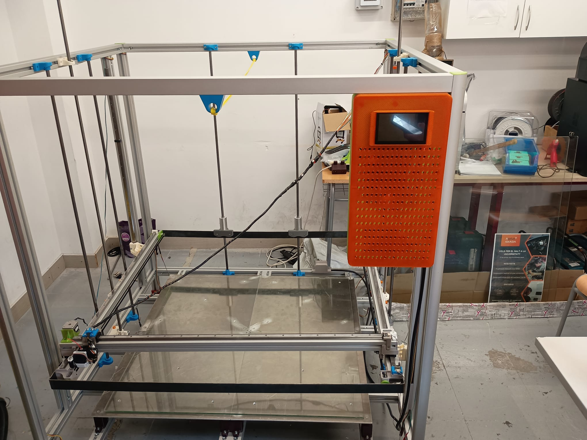
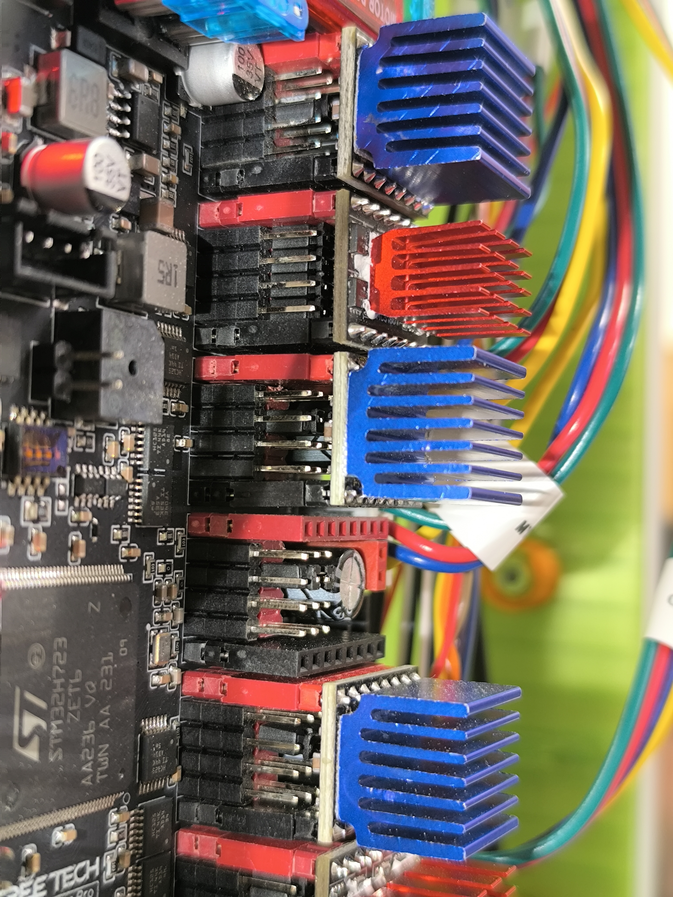
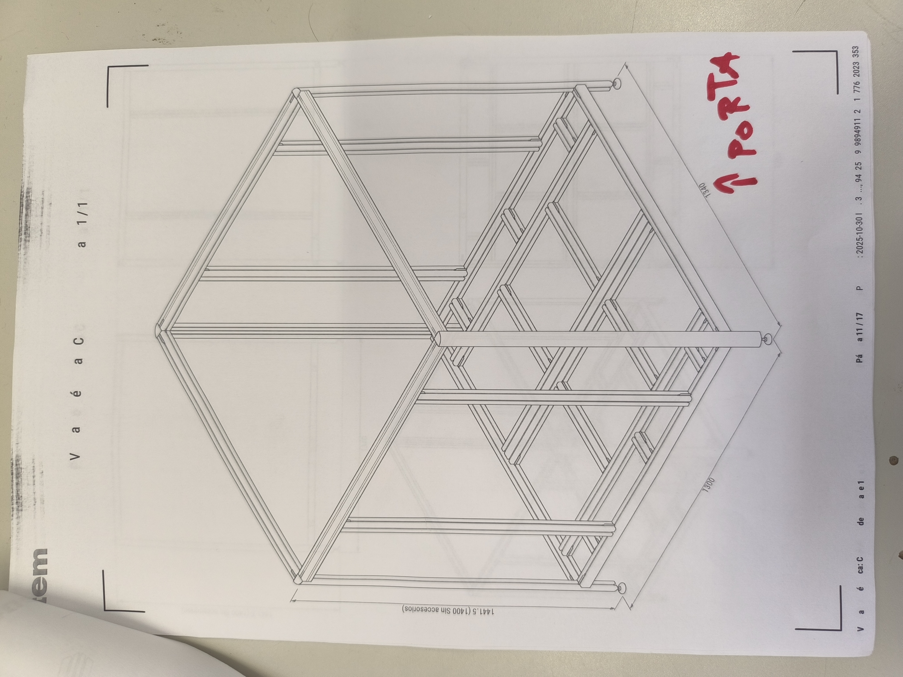

  

<h1 align="center">Impressora 3D Cartesiana 1000×1000×1000 mm</h1>

  <strong>Cicle Formatiu de Fabricació Additiva — CEFP 2025-2026</strong> 
  <strong>Institut Jaume Huguet — Antiga Escola del Treball</strong>, Valls (Tarragona) 
  <a href="https://institutjaumehuguet.cat">institutjaumehuguet.cat</a>

  
  
  

---

## Versions del repositori

| Idioma | Repositori |
|--------|------------|
| 🇪🇸 Castellà | [impresora-3d-1000x1000](https://github.com/xXSimon91Xx/impresora-3d-1000x1000) |
| 🏴󠁥󠁳󠁣󠁴󠁿 Català | **aquest repositori** |
| 🇬🇧 English | [impresora-3d-1000x1000-en](https://github.com/xXSimon91Xx/impresora-3d-1000x1000-en) |

---

## Índex de documentació

### Per començar — guia de la màquina
- [Què és aquesta màquina?](#què-és-aquesta-màquina) — resum accessible per a tots els nivells
- [L'equip](equipo.md) — alumnes, professors i agraïments
- [Diari del projecte](diario/progreso.md) — cronologia completa des del febrer de 2026

### Hardware
- [**Arxius 3D — 57 arxius STEP**](hardware/archivos-3d/) — ensamblatge complet, extrusor, eixos, llit (Sergio Tenorio)
- [Llista de materials — Estructura](hardware/lista-materiales-estructura.md)
- [Plànols estructurals — Marc item](hardware/planos-estructurales.md)
- [Placa BTT Octopus Pro](hardware/placa-octopus-pro.md)
- [Motors i drivers](hardware/motores-drivers.md)
- [Peces impreses en 3D](hardware/piezas-impresas.md)
- **Cablejat:**
  - [Visió general — tots els sistemes](hardware/cableado/overview.md)
  - [Eix X](hardware/cableado/eje-x.md) · [Eix Y dual](hardware/cableado/eje-y.md) · [Eix Z dual](hardware/cableado/eje-z.md)
  - [Extrusor Smart Orbiter v3.0](hardware/cableado/extrusor.md)
  - [CR Touch — Sonda Z](hardware/cableado/crtouch.md)
  - [Llit calefactat](hardware/cableado/cama.md)

### Firmware
- [Configuració completa (printer.cfg)](firmware/printer.cfg)
- [Instal·lació de Klipper al CB1](firmware/klipper-setup.md)
- [Calibració — PID, Z offset, Bed Mesh](firmware/calibracion.md)

### Problemes trobats i solucions
- [Índex de problemes](problemas/README.md)

### Idees de futur
- [Projectes i millores planificades](futuro.md)

---

## Què és aquesta màquina?

Aquesta impressora 3D pot fabricar objectes de fins a **1 metre de llarg, 1 metre d'ample i 1 metre d'alt**. És una de les impressores més grans que es poden construir amb peces comercials disponibles.

Es tracta d'una impressora **cartesiana**: el capçal d'impressió es mou als eixos X i Y, i l'estructura puja i baixa a l'eix Z. El material (filament de plàstic) es fon i es diposita capa a capa fins a formar la peça.

**Per a què serveix?** Per fabricar peces grans que no caben en una impressora normal: estructures, motlles, prototips industrials, peces de cotxes, projectes d'arquitectura, etc.

**Què la fa especial?** Tot el sistema de control (firmware Klipper) és de codi obert i s'hi pot accedir des de qualsevol dispositiu de la xarxa de l'institut. No necessita un ordinador connectat per imprimir — té el seu propi ordinador de control integrat (BTT CB1).

---

## La màquina acabada — 5 juny 2026

*La impressora 3D de 1000×1000×1000mm completament ensamblada al taller de l'Institut Jaume Huguet. Alçada total ~1,5m. KlipperScreen tàctil (taronja) muntat al perfil dret. Llit de vidre provisional instal·lat.*

*Vista frontal de la impressora a l'aula del taller. L'escala respecte al mobiliari de l'institut dona una idea de la mida de la màquina.*

---

## Fotos del projecte

### Panell d'electrònica instal·lat — 1 juny 2026

*Panell verd amb la BTT Octopus Pro V1.1, el CB1 i tots els cables etiquetats i connectats. El panell es desmunta per a manteniment.*

*La pantalla tàctil KlipperScreen (taronja) al costat del panell d'electrònica ja instal·lats a la màquina.*

*Detall dels drivers TMC2209 (blau) i TMC5160 (vermell) amb els cables etiquetats: MY1, MY2, MX, MZ1, MZ2, EXTRUSOR.*

### Primer arrencada amb Klipper

*Primera arrencada amb Fluidd al monitor Dell, KlipperScreen a la pantalla taronja, i tota l'electrònica connectada.*

### Placa base — BTT Octopus Pro V1.1

*Detall del xip STM32H723 de l'Octopus Pro amb els drivers TMC5160 (vermell, eix Z) i TMC2209 (blau, eixos XY i extrusor).*

*Vista frontal de la BTT Octopus Pro V1.1. TMC5160 vermells per a Z (alta intensitat), TMC2209 blaus per a X, Y i extrusor.*

### Estructura i guies lineals

*Guia lineal MGN15R amb carro muntat sobre perfil item 40×80mm.*

### Peces impreses en 3D

*Totes les peces impreses abans del muntatge: suports de motor (verd PETG), guies i clips (gris ASA).*

### Plànols estructurals — marcs item

*Vista isomètrica del marc d'alumini. Plànols generats amb el configurador d'item — 17 pàgines.*

---

## Especificacions tècniques

| Paràmetre | Valor |
|-----------|-------|
| **Volum d'impressió** | 1000 × 1000 × 1000 mm |
| **Cinemàtica** | Cartesiana (eixos X/Y/Z independents) |
| **Firmware** | Klipper + Fluidd (interfície web) + KlipperScreen |
| **Placa base** | BigTreeTech Octopus Pro V1.1 (STM32H723) |
| **Ordinador de control** | BigTreeTech CB1 (ARM Cortex-A55, Linux) |
| **Velocitat màxima** | 300 mm/s (XY), 5 mm/s (Z) |
| **Acceleració màxima** | 3000 mm/s² |
| **Extrusor** | LDO Smart Orbiter v3.0 (direct drive, reducció 7,5:1) |
| **Motor extrusor** | LDO-36STH20-1004AHG |
| **Hotend** | Broquet 0,4 mm, calefactor ceràmic 24V 72W |
| **Sensor Z** | CR Touch ALT04 (Creality) |
| **Drivers XY/Extrusor** | TMC2209 (UART, StealthChop) |
| **Drivers Z** | TMC5160-T Pro (SPI, alta intensitat, 2A) |
| **Motors XY** | NEMA 17 |
| **Motors Z** | NEMA 23 (2 unitats, Z dual independent) |
| **Guies lineals** | MGN15R (rodaments recirculants) |
| **Fusell Z** | M12 × 4 entrades → 8 mm/volta |
| **Marc** | Perfils item 40×80 mm (sèrie XMS, art. 0.0.669.99) |
| **Peces mecàniques** | PETG (verd, no crític) + ASA/ABS (gris, crític) |

---

## Història del projecte

Aquest projecte va ser dissenyat des del principi com una impressora de **1000×1000×1000 mm**, amb l'objectiu que la màquina quedi a l'**Institut Jaume Huguet** per a ús dels alumnes i com a referència perquè altres centres la puguin replicar.

Abans de construir-la, vam usar una impressora de 500×500 mm per validar el firmware i l'electrònica — així vam arribar a la impressora gran amb tot ja provat.

El repte tècnic més gran va ser el **doble eix Z amb NEMA 23**: necessiten 2 A de corrent, la qual cosa obliga a usar drivers TMC5160 (els TMC2209 normals no aguanten). A més, un dels slots de la placa va resultar estar defectuós de fàbrica i es va haver de moure el motor al slot MOTOR 5.

El marc està construït amb **perfils item 40×80 mm**, un sistema modular d'alumini tècnic usat en maquinària industrial, que garanteix rigidesa i precisió fins i tot a aquesta escala.

---

*Cicle Formatiu de Fabricació Additiva — CEFP 2025-2026 | Institut Jaume Huguet — Antiga Escola del Treball, Valls*
