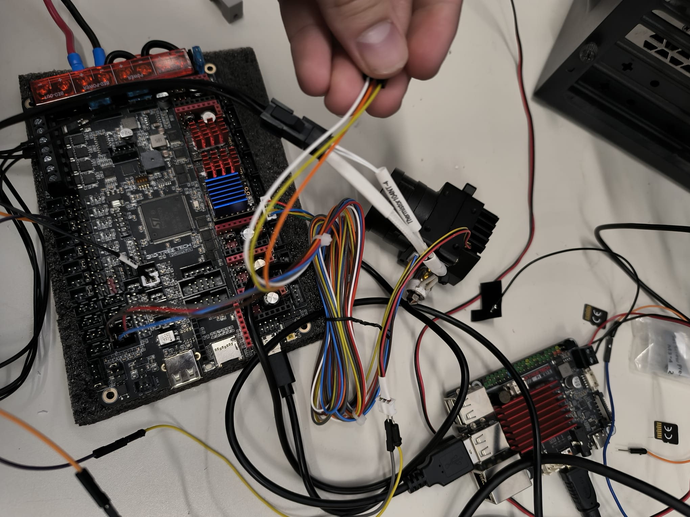
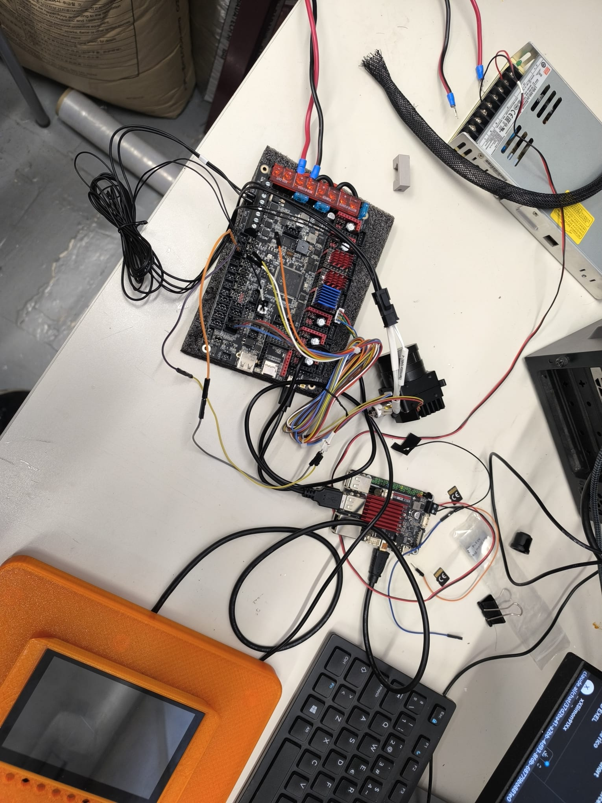
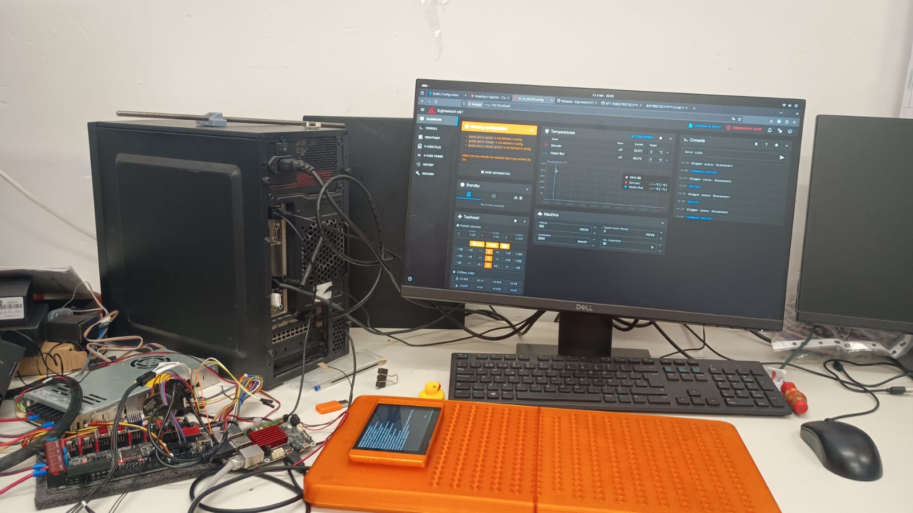
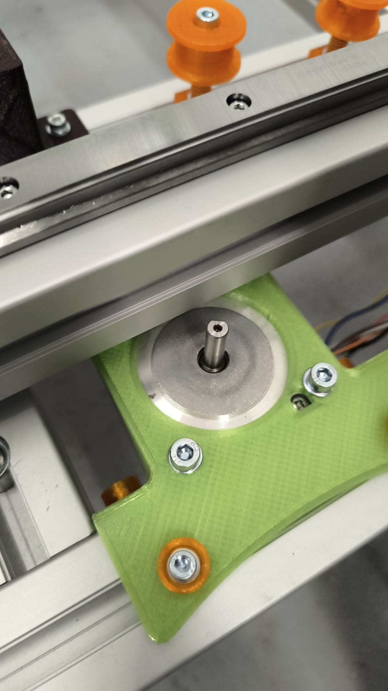
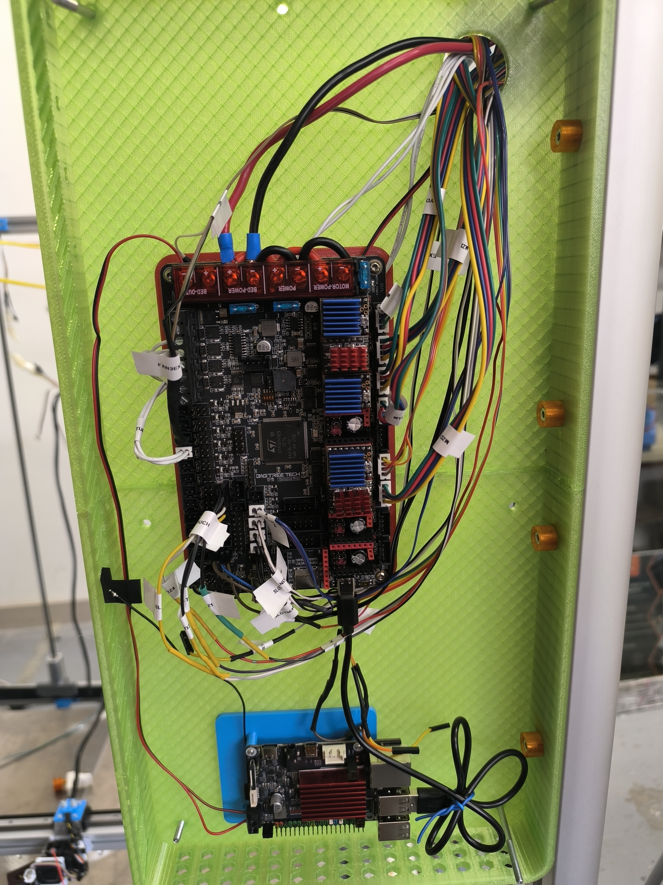
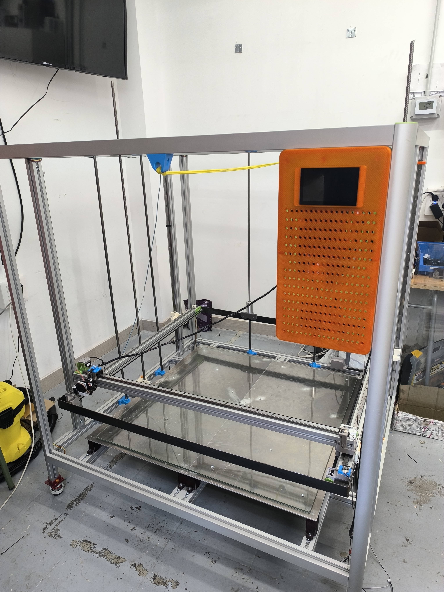
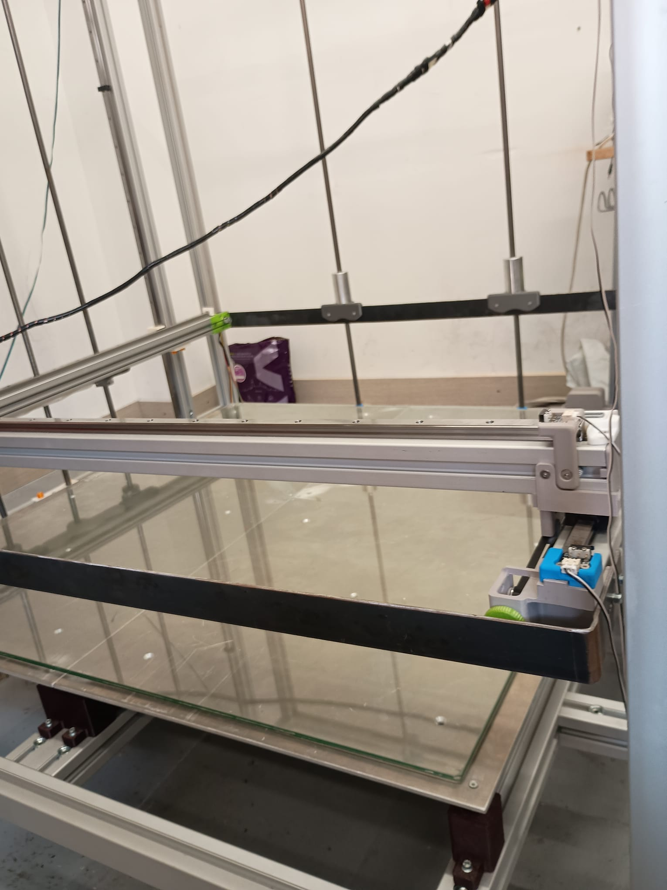
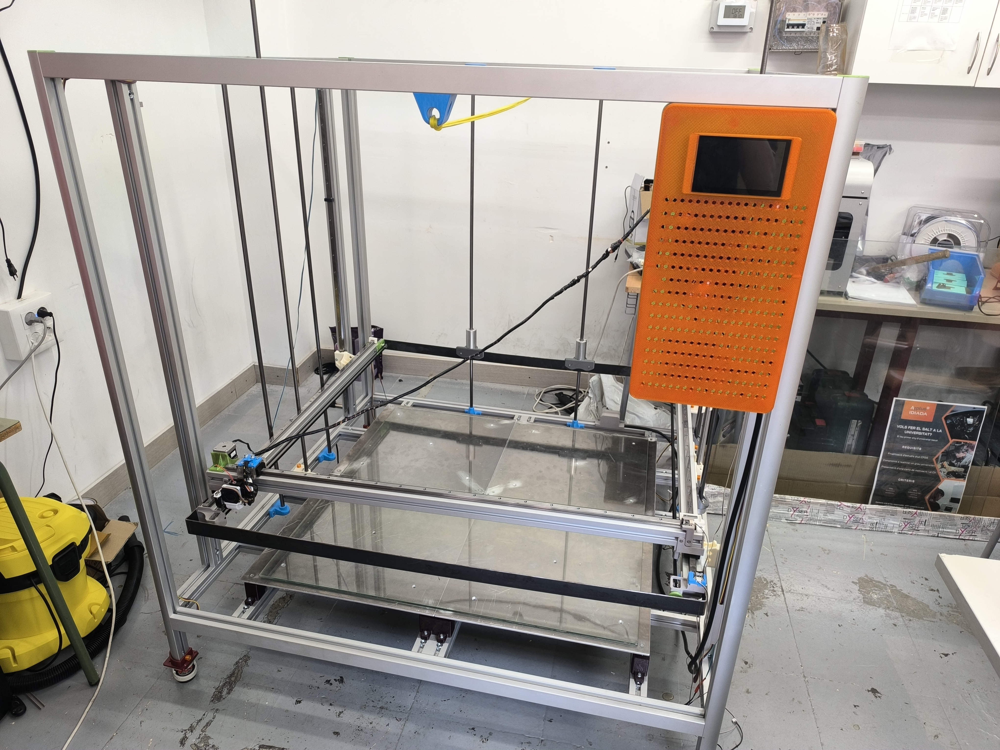

# Diari del projecte

> Cronologia completa: des dels primers components al febrer fins a la impressora d'1m³ funcionant.

---

## Fase 0 — Recepció de components i primeres inspeccions (Febrer 2026)

### 25 de febrer — Arriba l'Octopus Pro

Vam rebre la BTT Octopus Pro V1.1 i la vam inspeccionar abans de connectar res.

*Vista posterior de la placa recentment rebuda. Es poden llegir clarament tots els slots: MOTOR0, MOTOR1, MOTOR2_1, MOTOR2_2... fins a MOTOR7. Versió: 1.1.*

També vam inspeccionar la zona del USB-C i el connector de la font d'alimentació.

**Primer pas:** Identificar tots els slots de driver i planificar quin motor va a cada slot abans de connectar res.

---

## Fase 1 — Muntatge de l'estructura (Febrer–Març 2026)

El primer pas real del projecte va ser tallar i muntar el **marc de perfils d'alumini item 40×80mm**.

### Materials de l'estructura
- Perfils item 40×80mm tallats a mida (vegeu [llista de materials](../hardware/lista-materiales-estructura.md))
- Connectors angulars metàl·lics per unir els perfils a les cantonades
- Cargoleria M3 i M4 amb femelles T a la ranura del perfil

### Peces impreses per a l'estructura

Durant aquesta fase es van imprimir totes les peces en 3D necessàries:

*Totes les peces impreses llestes a l'aula: suports de motor verds i guies grises.*

*Suports per als 4 motors NEMA 23 de l'eix Z.*

*Tensors de corretja GT2 i suports impresos.*

---

## Fase 2 — Primera electrònica: prova de la placa (Abril 2026)

### 8 d'abril — Primeres connexions

Vam connectar els primers components a l'Octopus Pro per provar que la placa funcionava abans de muntar-la a l'estructura.

*CR Touch model ALT04 amb els seus 5 cables de colors.*

*Cables del hotend identificats: termistor ATC Semitec 104NT-4 i calentador ceràmic 24V 72W.*

*Vista general de la placa amb drivers instal·lats: TMC5160 vermells (Z) i TMC2209 blaus (X, Y, extrusor).*

### 10 d'abril — Primera arrencada amb CR Touch

Vam connectar el CR Touch a la placa i vam arrencar Klipper per primera vegada.

*Placa connectada a la font d'alimentació i al CR Touch per al primer test.*

**Problema trobat:** Klipper no arrencava perquè faltava `z_offset: 0` a la secció `[bltouch]`.  
→ Vegeu [crtouch-z-offset.md](../problemas/crtouch-z-offset.md)

### 10 d'abril — Test de motors

*Connectant els cables del CR Touch als pins PB6 i PB7 de l'Octopus Pro.*

---

## Fase 3 — Problemes de maquinari (Abril 2026)

### Slot MOTOR 3 defectuós

Vam descobrir que el slot MOTOR 3 de la placa estava **defectuós de fàbrica**. El motor Z dret no responia.

**Diagnòstic:** Vam provar el driver en altres slots — funcionava. Vam provar el motor en altres slots — funcionava. El slot MOTOR 3 estava mort.

**Solució:** Moure el motor Z dret al slot **MOTOR 5** i actualitzar `printer.cfg`.

→ Vegeu [motor-z-slot-defectuoso.md](../problemas/motor-z-slot-defectuoso.md)

### Motor Y no es movia

El motor Y no responia. Diagnòstic ràpid: **el cable JST no estava ben connectat**.

**Lliçó:** Abans de canviar configuració, sempre revisar el cable físic.

→ Vegeu [eje-y-dual.md](../problemas/eje-y-dual.md)

---

## Fase 4 — Cablejat complet (23 d'abril 2026)

*Sessió de cablejat: tots els motors, sensors i calefactors connectats a la placa.*

*Setup de treball: Octopus Pro + CB1 + teclat + pantalla amb Fluidd. La tauleta taronja és la pantalla KlipperScreen.*

### Problemes de ventilació

El ventilador del dissipador del SO3 no s'apagava mai. La causa: estava configurat com a `[fan]` (ventilador de capa) en lloc de `[heater_fan]`.

→ Vegeu [ventilador-hotend.md](../problemas/ventilador-hotend.md)

---

## Fase 5 — Primera arrencada de Klipper

*Primera arrencada amb errors de configuració. Fluidd mostra els avisos de printer.cfg que cal corregir abans de poder moure res. La tauleta taronja (KlipperScreen) ja està activa.*

*Klipper funcionant! Fluidd mostrant la interfície completa al monitor Dell. A l'esquerra el rack d'electrònica amb tot connectat.*

*Setup de desenvolupament complet: monitor Dell amb Fluidd, KlipperScreen taronja a la taula i tota l'electrònica muntada a l'esquerra.*

Al monitor es veu la interfície de Fluidd amb:
- Temperatura del hotend i la cama
- Controls de moviment XYZ
- Consola per a comandaments G-code
- Estat de la impressora

La tauleta taronja a la taula és la **BTT KlipperScreen** — pantalla tàctil per controlar la impressora sense necessitat d'un PC.

---

## Fase 6 — Muntatge a l'estructura (Maig 2026)

### 22 d'abril — Guies lineals i carro

Vam instal·lar les guies lineals MGN15R a l'eix Y:

*Guia MGN15R amb carro instal·lada al perfil item 40×80mm.*

*Suport de motor imprès (verd) muntat sobre el perfil item 40×80mm. La politja lliure taronja guia la corretja GT2. A la part superior es veuen els tensors impresos també en taronja.*

### 13 de maig — Cargol i eix Z

Vam instal·lar els cargols trapezials M12 de 1200mm amb els seus suports impresos:

*Cargol M12 (4 entrades, 8mm/rev) instal·lat al perfil vertical de l'eix Z.*

*Suport imprès en blau per a l'extrem superior del cargol.*

---

## Fase 7 — Integració final del capçal

*Manat de cables del capçal ja instal·lat a la impressora. Els cables estan etiquetats com a "EXTRUSOR" per facilitar el manteniment.*

---

## Fase 8 — Cablejat complet i etiquetatge (1 juny 2026)

### 1 de juny — Sessió de cablejat final

Sessió completa de connexió de tots els cables al panell d'electrònica verd. Es van etiquetar tots els connectors abans d'endollar.

**Sistema d'etiquetatge de cables:**

| Etiqueta | Cable |
|----------|-------|
| `MY1` | Motor Y esquerre (MOTOR2_1) |
| `MY2` | Motor Y dret (MOTOR2_2, paral·lel) |
| `MX` | Motor X (MOTOR0) |
| `MZ1` | Motor Z esquerre (MOTOR1) |
| `MZ2` | Motor Z dret (MOTOR5) |
| `BLTOU` | Cable de control CR Touch (servo, PB6) |
| `NDSTOPZ` | Endstop Z màxim (PF7) |
| `NDSTOPX` | Endstop X (PF5) |
| `BED` | Cables cama calefactada (pendent) |

*Panell verd amb Octopus Pro + CB1 completament cablejat. Tots els connectors porten etiquetes impreses.*

*Detall dels drivers amb cables etiquetats sortint cap als motors.*

*La pantalla KlipperScreen (carcassa taronja impresa en 3D) instal·lada al costat del panell d'electrònica a la màquina.*

### Incident — Cable d'endstop trencat

Durant el procés d'etiquetatge es va trobar un cable d'endstop amb l'extrem pelat (sense terminal). Es va resoldar i es va crimpar un terminal nou.

**Lliçó**: sempre revisar la continuïtat dels cables d'endstop abans d'energitzar.

---

## Fase 9 — Màquina completament assemblada (5 juny 2026)

La impressora està **dreta i operativa** al taller de l'Institut Jaume Huguet. Aquesta és la primera vegada que la màquina es veu completament muntada a la seva ubicació final.

### Estat del muntatge

*Impressora 3D de 1000×1000×1000mm completament assemblada al taller. Alçada total aproximada 1.5m. KlipperScreen (taronja) muntat al perfil lateral dret.*

*Vista interior des de dalt: cama de vidre provisional instal·lada sobre el marc inferior. Els cables de l'eix X recorren l'estructura.*

*Carro de l'eix Y amb l'endstop (blau) muntat i el capçal d'impressió en posició.*

*La impressora en el context de l'aula-taller. L'escala respecte al mobiliari de l'institut mostra la mida real de la màquina.*

### Components muntats en aquesta fase
- ✅ Marc item 40×80mm completament assemblat
- ✅ Guies lineals MGN15R instal·lades a X, Y, Z
- ✅ Motors NEMA17 (X, Y×2) i NEMA23 (Z×2) muntats
- ✅ Cargols M12 instal·lats i acoblats
- ✅ Panell d'electrònica (Octopus Pro + CB1) instal·lat
- ✅ KlipperScreen muntat al perfil lateral
- ✅ Cama de vidre provisional (per a primeres proves)
- ✅ Potes niveladoras instal·lades
- ⏳ Cama calefactada (4 × 500×500mm) — pendent instal·lar

---

## Estat actual

| Sistema | Estat |
|---------|-------|
| Marc estructura | ✅ Muntat |
| Guies lineals MGN15R | ✅ Instal·lades |
| Eix X | ✅ Funcionant |
| Eix Y dual (2 motors paral·lel) | ✅ Funcionant |
| Eix Z dual (TMC5160 + NEMA23) | ✅ Funcionant |
| Extrusor SO3 | ✅ Funcionant |
| CR Touch + Bed Mesh 5×5 | ✅ Configurat |
| Z_TILT_ADJUST | ✅ Configurat |
| Klipper + Fluidd + KlipperScreen | ✅ Funcionant |
| Cama calefactada (4×500×500mm) | ⏳ Pendent instal·lar |
| Arxius 3D de peces | ⏳ Pendent pujar |

---

## Pendents

- [ ] Instal·lar termistor a la cama calefactada
- [ ] Instal·lar 4 × cames calefactades 500×500mm en paral·lel
- [ ] Pujar arxius STL/STEP de peces impreses
- [ ] Completar calibratge final (PID cama, Z offset definitiu amb `PROBE_CALIBRATE`)
- [ ] Afegir ventiladors al panell d'electrònica
