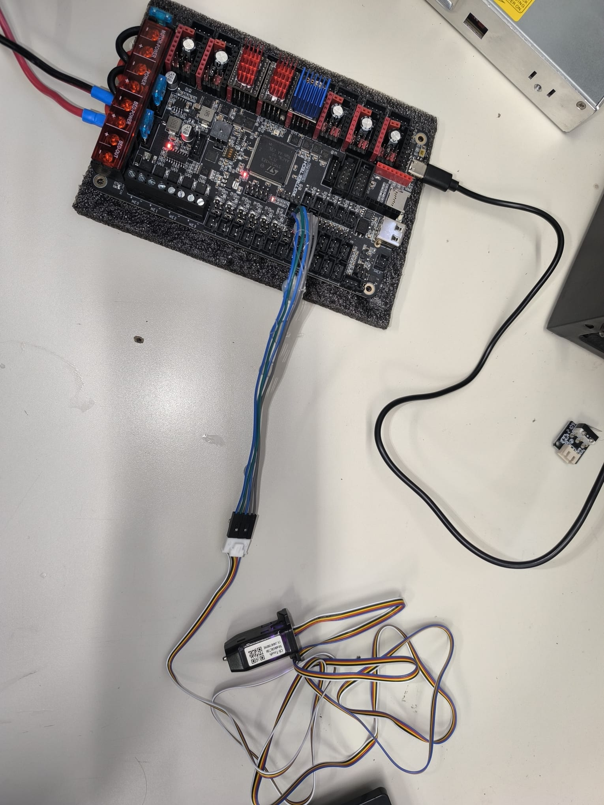

# Cablejat — CR Touch (Sonda Z virtual)

> El CR Touch reemplaça l'endstop físic de Z i permet la nivellació automàtica del llit.

---

## Model

**Creality CR Touch — ALT04** (CX:24040700098C)


*CR Touch model ALT04 amb el seu cable de 5 colors. El costat esquerre és el connector de la placa (JST), el dret el del sensor.*


*CR Touch connectat a l'Octopus Pro per al primer test. Es pot veure el cable de 5 fils connectat als pins PB6 (groc) i PB7 (blau).*


*Procés de connexió: inserint el connector JST del CR Touch als pins correctes de l'Octopus Pro.*

---

## Pinout — Els 5 cables

| Cable | Color | Funció | Pin Octopus Pro |
|-------|-------|--------|-----------------|
| 1 | Blau | Senyal de sensor (toc) | **PB7** |
| 2 | Vermell | GND | GND |
| 3 | Groc | Control del servo (deploy/retract) | **PB6** |
| 4 | Negre | Alimentació 5V | 5V |
| 5 | Blanc | GND | GND |

> Els colors poden variar lleugerament entre fabricants. Verificar amb el manual inclòs a la caixa.

---

## Configuració a printer.cfg

```ini
[bltouch]
sensor_pin: ^PB7           # ^ = pullup. Senyal de detecció de toc
control_pin: PB6           # Control del servo
pin_up_touch_mode_reports_triggered: False
x_offset: 0               # Offset respecte al broquet (calibrar físicament)
y_offset: 0               # Offset Y (calibrar físicament)
z_offset: 0               # Calibrar amb PROBE_CALIBRATE
speed: 5.0                # Velocitat de sondeig (lenta per a precisió)
lift_speed: 10.0
samples: 2                # 2 mostres per punt (promig)
sample_retract_dist: 5.0
```

### Home segur amb CR Touch

```ini
[safe_z_home]
home_xy_position: 500, 500  # Centre del llit 1000×1000
speed: 100
z_hop: 10                   # Puja 10mm abans de moure's (evita friccions)
z_hop_speed: 10
```

El home en Z funciona així:
1. Fa home en X i Y primer
2. Es mou al centre del llit (500, 500)
3. Baixa lentament fins que el CR Touch detecta el llit
4. Aquella posició és el "zero" de Z

---

## Bed Mesh — Mapa de nivellació 5×5

```ini
[bed_mesh]
speed: 100
horizontal_move_z: 5
mesh_min: 30, 30          # Cantonada mínima del mapa
mesh_max: 970, 970        # Cantonada màxima (marge respecte a 1000)
probe_count: 5, 5         # 5×5 = 25 punts de sondeig
mesh_pps: 2, 2            # Interpolació entre punts
algorithm: bicubic        # Algorisme per a superfícies complexes
```

El mapa de 25 punts compensa les irregularitats del llit. Klipper ajusta l'alçada Z en temps real durant la impressió perquè la primera capa quedi uniforme a tota la superfície d'1m².

---

## Calibració del z_offset

Procediment inicial:

```
# 1. Escalfar a temperatura d'impressió
M104 S210
M190 S60

# 2. Fer home complet
G28

# 3. Iniciar calibració
PROBE_CALIBRATE

# 4. Baixar manualment amb paper (mètode del paper)
TESTZ Z=-0.1   # baixar 0.1mm
TESTZ Z=+0.05  # pujar 0.05mm
# repetir fins que el paper tingui resistència mínima

# 5. Desar
ACCEPT
SAVE_CONFIG
```

El valor es desa automàticament al bloc `#*# SAVE_CONFIG` del `printer.cfg`.

---

## Per què CR Touch en lloc d'endstop mecànic a Z

Amb un llit d'1m², és impossible nivelar-lo manualment amb suficient precisió. El CR Touch permet:

1. **Nivellació automàtica** (`Z_TILT_ADJUST`) — iguala els dos motors Z
2. **Mapa de llit** (`BED_MESH_CALIBRATE`) — compensa ondulacions de la superfície
3. **Reproduïbilitat** — cada impressió comença exactament a la mateixa alçada
