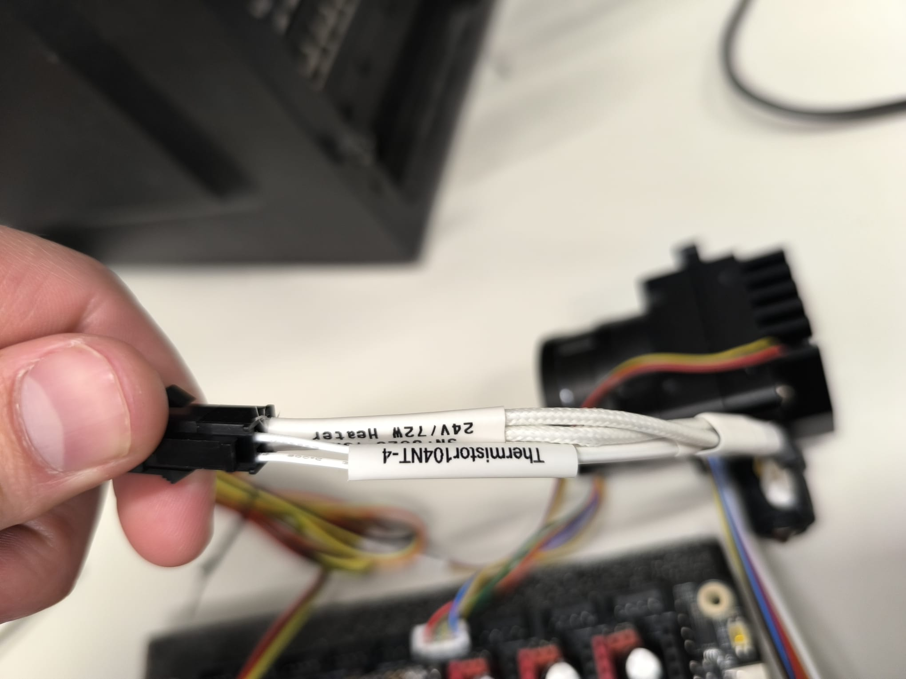

# Cablejat — LDO Smart Orbiter v3.0

> L'extrusor és el component més complex del capçal: motor, hotend, termistor, calefactor, ventilador, sensor de filament i botó de descàrrega.

---

## Cables del capçal instal·lats a la impressora


*Manat de cables del capçal amb etiqueta "EXTRUSOR" ja instal·lat a la impressora. El manat inclou: motor, termistor, calefactor, ventilador, sensor de filament, botó i CR Touch.*


*Detall de l'extrem del connector: etiquetes "Thermistor104NT-4" i "24V/72W Heater" per identificar cada cable sense errors.*

---

## Components del capçal

| Component | Especificació |
|-----------|---------------|
| Extrusor | LDO Smart Orbiter v3.0 (direct drive, reducció 7.5:1) |
| Motor | LDO-36STH20-1004AHG (compacte, 1A nominal) |
| Driver | TMC2209 (UART), slot MOTOR 4 |
| Termistor | ATC Semitec 104NT-4-R025H42G |
| Calefactor | 24V, 72W ceràmic |
| Ventilador heatsink | Frameless 24V (integrat al SO3) |
| Sensor filament | Integrat al SO3 (switch) |
| Botó descàrrega | Integrat al SO3 |

---

## Motor i driver

```ini
[extruder]
step_pin: PF9
dir_pin: PF10
enable_pin: !PG2
microsteps: 16
full_steps_per_rotation: 200
rotation_distance: 4.637   # calibrat (oficial SO3: 4.69)
nozzle_diameter: 0.400
filament_diameter: 1.750
max_extrude_only_distance: 500
max_extrude_only_velocity: 120

[tmc2209 extruder]
uart_pin: PF2
run_current: 0.850
hold_current: 0.100
stealthchop_threshold: 0   # StealthChop DESACTIVAT — màxima resposta
```

### Per què StealthChop desactivat a l'extrusor

StealthChop fa el motor silenciós però introdueix latència als canvis de velocitat. Per a l'extrusor necessitem **màxima resposta** en les acceleracions i desacceleracions de filament. El soroll extra de l'extrusor és acceptable.

### Calibració de rotation_distance

El SO3 té una relació de reducció de 7.5:1. El valor oficial és `4.69`, però va caldre calibrar-lo:

```bash
# Procediment de calibració:
# 1. Marcar el filament a 100mm de l'entrada
# 2. Enviar comanda d'extrusió: G1 E100 F100
# 3. Mesurar quant filament ha entrat realment (per ex: 98.7mm)
# 4. rotation_distance_nou = rotation_distance_actual × (mesurat / demanat)
# 4.69 × (98.7 / 100) = 4.637
```

---

## Hotend

```ini
heater_pin: PA3            # HE0 — calefactor ceràmic 24V 72W
sensor_type: ATC Semitec 104NT-4-R025H42G
sensor_pin: PF4            # T0 — termistor
min_temp: 0
max_temp: 300
min_extrude_temp: 170      # protecció: no extrueix fred

# PID calibrat (resultat de PID_CALIBRATE HEATER=extruder TARGET=220)
control = pid
pid_kp = 22.602
pid_ki = 1.408
pid_kd = 90.690
```

El bloc PID va quedar desat automàticament a `#*# SAVE_CONFIG` després d'executar:
```
PID_CALIBRATE HEATER=extruder TARGET=220
SAVE_CONFIG
```

---

## Ventilador heatsink

El SO3 té un ventilador frameless integrat. **Només té 2 pins** (VCC i GND), sense senyal PWM.

```ini
[heater_fan hotend_fan]
pin: PD12              # FAN2 de l'Octopus Pro
heater: extruder
heater_temp: 50.0      # s'activa quan hotend > 50°C
fan_speed: 1.0         # sempre a màxima velocitat quan actiu
```

**Cablejat del ventilador frameless:**
```
Ventilador SO3 (2 cables):
  Vermell → VCC FAN2 a l'Octopus
  Negre   → GND FAN2 a l'Octopus
  (El tercer cable groc de senyal PWM no es connecta)
```

> Els connectors FAN de l'Octopus Pro tenen 3 pins (VCC, GND, senyal). Per a ventiladors de 2 fils, connectar només VCC i GND.

---

## Sensor de filament

```ini
[filament_switch_sensor sensor_filamento]
switch_pin: ^PG11
pause_on_runout: True
runout_gcode:
  M118 Filament esgotat - pausant impressió
```

Quan el filament s'acaba, el sensor obre el circuit → Klipper pausa la impressió automàticament.

## Botó de descàrrega

```ini
[gcode_button boton_descarga]
pin: ^!PG10            # ^! = pullup + lògica invertida (normalment tancat)
press_gcode:           # (buit)
release_gcode:
  M118 Botó descàrrega premut
  filament_unload_init
```

En soltar el botó físic (no en prémer), executa la macro de descàrrega:

```ini
[gcode_macro filament_unload_init]
gcode:
  
    M109 S185          # escalfar a 185°C
    G92 E0
    G1 E-5 F3000       # retracció ràpida 5mm
    G1 E-25 F300       # retracció lenta 25mm
    M104 S0            # apagar calefactor
  
    M118 No es pot descarregar mentre s'imprimeix!
  
```
