# Cablejat — Vista general

> Mapa de connexions de tots els sistemes a la BTT Octopus Pro V1.1.

---

## Diagrama de sistemes

```mermaid
graph TD
    PSU[Font d'alimentació 24V] --> OCT[BTT Octopus Pro V1.1]
    CB1[BTT CB1 ARM] <-->|USB-C| OCT

    OCT -->|MOTOR 0 - UART| X[Motor X - NEMA17]
    OCT -->|MOTOR 2_1 - UART| Y1[Motor Y esq - NEMA17]
    OCT -->|MOTOR 2_2 paral·lel| Y2[Motor Y dret - NEMA17]
    OCT -->|MOTOR 1 - SPI| Z1[Motor Z esq - NEMA23]
    OCT -->|MOTOR 5 - SPI| Z2[Motor Z dret - NEMA23]
    OCT -->|MOTOR 4 - UART| EXT[Extrusor SO3 - LDO]

    OCT -->|PF5 T1 endstop| ES_X[Endstop X]
    OCT -->|PF6 T2 endstop| ES_Y[Endstop Y]
    OCT -->|PF7 T3| ES_ZMAX[Endstop Z màxim]
    OCT -->|PB6 control / PB7 sensor| CRT[CR Touch ALT04]

    OCT -->|PF4 T0| THERM_E[Termistor extrusor]
    OCT -->|PF3 T1| THERM_B[Termistor llit pendent]
    OCT -->|PA3 HE0| HEAT_E[Calefactor hotend 24V 72W]
    OCT -->|PA1 HE_BED| HEAT_B[Calefactor llit]

    OCT -->|PD12 FAN2| FAN_HS[Ventilador heatsink SO3]
    OCT -->|PG11 endstop| FIL[Sensor filament SO3]
    OCT -->|PG10 gcode_button| BTN[Botó descàrrega SO3]
```



---

## Mapa de slots usats

| Slot físic | Component | Driver | Pin step | Pin dir | Pin enable |
|------------|-----------|--------|----------|---------|------------|
| MOTOR 0 | Motor X | TMC2209 | PF13 | PF12 | !PF14 |
| MOTOR 1 | Motor Z esq | TMC5160 | PG0 | PG1 | !PF15 |
| MOTOR 2_1 | Motor Y (×2 paral·lel) | TMC2209 | PF11 | PG3 | !PG5 |
| MOTOR 2_2 | Motor Y dret (paral·lel) | — | — | — | — |
| MOTOR 3 | **DEFECTUÓS** — no usar | — | — | — | — |
| MOTOR 4 | Extrusor SO3 | TMC2209 | PF9 | PF10 | !PG2 |
| MOTOR 5 | Motor Z dret | TMC5160 | PC13 | !PF0 | !PF1 |

> El `!` a dir_pin = inversió de direcció (el motor giraria al revés sense ell).

---

## Pins d'endstop

| Component | Pin | Mode | Connector a la placa |
|-----------|-----|------|----------------------|
| Endstop X | PF5 | Digital, pullup invertit | T1 |
| Endstop Y | PF6 | Digital, pullup invertit | T2 |
| Endstop Z virtual | probe:z_virtual_endstop | CR Touch | (via bltouch) |
| Endstop Z màxim | PF7 | Digital, pullup | T3 |

---

## Pins de temperatura

| Component | Pin | Tipus | Connector |
|-----------|-----|-------|-----------|
| Termistor extrusor | PF4 | ATC Semitec 104NT-4-R025H42G | T0 (J45) |
| Termistor llit | PF3 | EPCOS 100K (placeholder) | BED (J44) |

---

## Pins de calefacció

| Component | Pin | Especificació |
|-----------|-----|---------------|
| Hotend | PA3 | 24V, 72W ceràmic |
| Llit | PA1 | 24V (potència variable) |

---

## Pins de ventilador

| Ventilador | Pin | Tipus a Klipper |
|-----------|-----|-----------------|
| Heatsink SO3 | PD12 (FAN2) | `[heater_fan]` — controlat per temp hotend |
| Ventilador de capa | PD13 (FAN3, J53) | `[fan]` — controlat pel slicer (M106/M107) |

---

## CR Touch — Pinout complet

| Cable | Color | Funció | Pin Octopus |
|-------|-------|--------|-------------|
| 1 | Blau | Sensor / senyal toc | PB7 |
| 2 | Vermell | GND | GND |
| 3 | Groc | Control (servo) | PB6 |
| 4 | Negre | 5V | 5V |
| 5 | Blanc | GND | GND |

---

## Alimentació

L'Octopus Pro té tres entrades d'alimentació independents:

```
MOTOR-POWER   → 24V — alimenta els drivers (1-8 tots)
POWER         → 24V — alimenta la lògica, ventiladors, hotend
BED-POWER     → 24V — alimenta exclusivament el llit calefactat
BED-OUT       → sortida cap al llit
```

> Separar BED-POWER de la resta és important: el llit consumeix molt de corrent i pot causar soroll al senyal dels motors si comparteix rail amb ells.

**Configuració actual:** les tres entrades estan pontades per usar una única font 24V.  
**Futur:** separar BED-POWER per connectar un relé d'alta potència (4 llits 500×500mm en paral·lel).

---

## Crimpeig de cables

Tots els connectors JST del projecte estan crimpats a mà amb l'eina apropiada.


*Eina crimpadora Wirefy amb joc de matrius intercanviables. Cada matriu correspon a una mida de terminal: 0.5mm², 1mm², 1.5mm², 2.5mm². Els cables es tallen a la longitud necessària i es crimpa el terminal abans d'inserir a la carcassa JST.*
