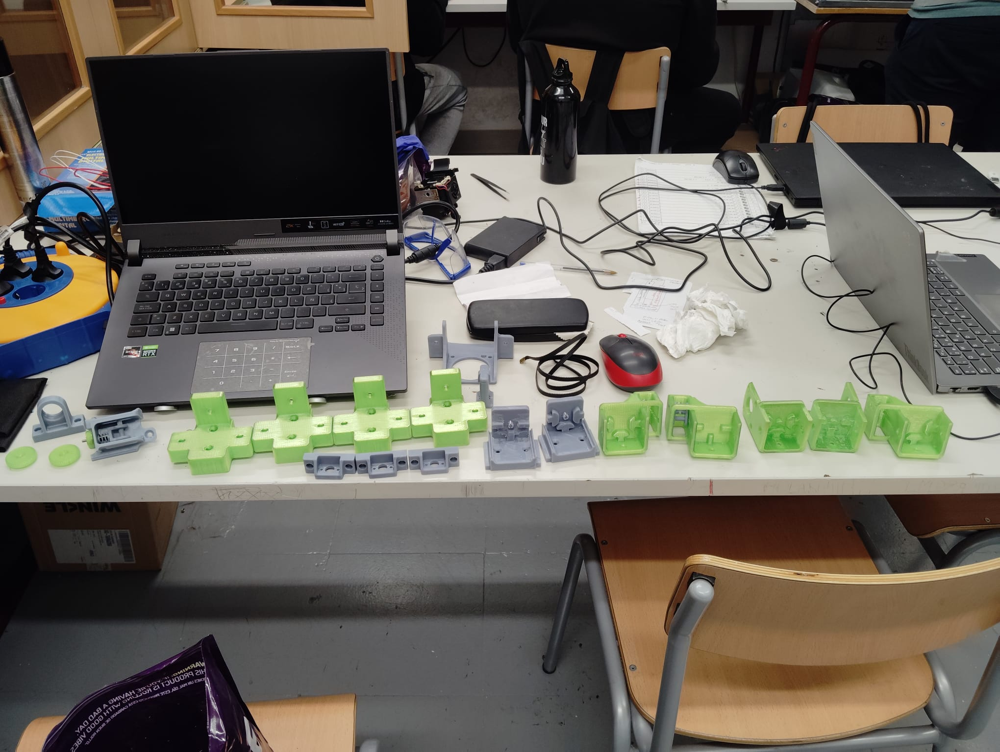
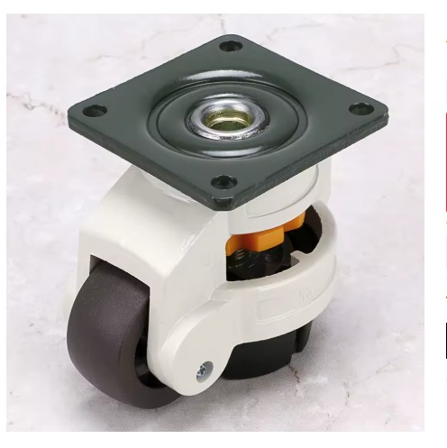

# Peces impreses en 3D

> Tots els suports i peces mecàniques de la impressora estan impreses en 3D. Això permet adaptar cada peça exactament al disseny sense dependre de peces comercials difícils de trobar.

---

## Materials d'impressió

| Material | Color | Ús |
|---------|-------|-----|
| PETG | Verd | Peces estructurals no crítiques (escuadres, suports, protectors de barra, topes) |
| ASA / ABS | Gris | Peces crítiques que requereixen major resistència (guies de fusell, portacables funcionals) |

---

## Catàleg de peces

### Suports de motor NEMA 23 — ×4

Grans suports verds que allotgen els motors NEMA 23 dels eixos X i Y. Tenen espai per al motor, l'acoblador i la corretja GT2.

*Quatre suports per als motors NEMA 23 dels eixos X i Y.*

---

### Connectors de perfil d'alumini

Connectors metàl·lics que uneixen els perfils d'alumini item 40×80mm entre si i ancoren les guies lineals (eixos X/Y i Z) al marc. No són peces impreses — són connectors comercials d'acer/alumini.

*Diagrama de muntatge: la femella lliscant entra a la ranura del perfil item 40×80mm i el cargol la apressa des de dins.*

*Connector angular metàl·lic per unir dos perfils d'alumini en angle recte.*

*Tensors de corretja GT2 i suports.*

---

### Guies i suports de fusell (grisos)

Peces grises que subjecten el fusell trapezoïdal M12 i el mantenen alineat amb el marc.

*Subjectadors de fusell, engranatges de calibració i suport d'endstop.*

---

### Suports de motor per a l'eix corretja (tensors)

Peces verdes amb ranures per ajustar la tensió de la corretja GT2 dels eixos X i Y.

*Suport de motor amb politja metàl·lica muntat sobre el perfil d'alumini.*

---

### Portacables i organitzadors

Peces grises petites que guien els cables pel marc i els mantenen ordenats.

---

## Totes les peces a l'aula

*Vista completa de totes les peces impreses abans del muntatge. Les verdes són estructurals, les grises són auxiliars.*

*Vista més àmplia: tota la gamma de peces estesa a la taula de l'aula — suports de motor, portacables, tensors de corretja i guies.*

*Els quatre suports de motor NEMA 23 (verd) alineats. El disseny en U permet allotjar el motor, l'acoblador i la part superior del fusell.*

*Tensors de corretja GT2 verds, portacables grisos i suport de motor. Al fons es veu la corretja GT2.*

*Peces auxiliars grises: portacables, engranatges de calibració i suport de sensor de filament muntat.*

*Tensors de corretja GT2 (verd), suport d'endstop (gris), i la corretja GT2 de pas 2mm, amplada 6mm. També es veuen els suports de ventilador i el carril guia.*

---

## Render del sistema de tensió de corretges

*Renderitzat 3D del sistema de tensió de corretges GT2 dels eixos X i Y, mostrant el mecanisme d'ajust de tensió.*

---

## Potes niveladoras amb bloqueig

L'estructura reposa sobre **4 rodes niveladoras** amb bloqueig. Permeten moure la impressora fàcilment i fixar-la quan està en posició.

*Roda niveladora amb mecanisme de bloqueig. El botó taronja baixa un suport metàl·lic que eleva la roda del terra, immobilitzant la màquina.*

---

## Millores futures planificades

### Tancament amb panells de policarbonat

Per poder imprimir materials tècnics (ABS, ASA, TPU) que necessiten temperatura ambient estable, es planeja tancar la màquina amb panells de policarbonat corrugat fixats amb **imants de neodimi**.

*Panell corrugat de policarbonat — lleuger, resistent i fàcil de tallar a mida.*

*Imant de neodimi ø10×5mm — encastat a les peces impreses per retenir els panells sense cargols.*

Els panells es fixen sense cargols: els imants van encastats a les peces impreses del marc i al cantell del panell, permetent obrir-los i tancar-los ràpidament.

---

## Arxius 3D

Els arxius STEP de tots els components del projecte estan disponibles a la carpeta [`hardware/archivos-3d/`](archivos-3d/).

Inclou: ensamblatge complet, extrusor Smart Orbiter v3.0, eixos X/Y/Z, llit calefactat, perfils item i elements de transmissió (57 arxius STEP en total).

Format STEP — compatible amb FreeCAD, Fusion 360, SolidWorks i qualsevol CAD estàndard. També visualitzables en línia a [3dviewer.net](https://3dviewer.net).
