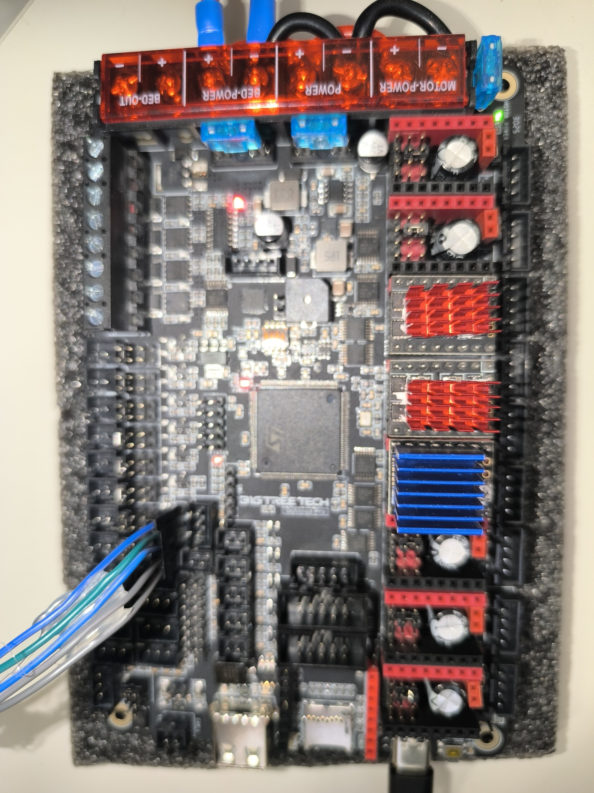
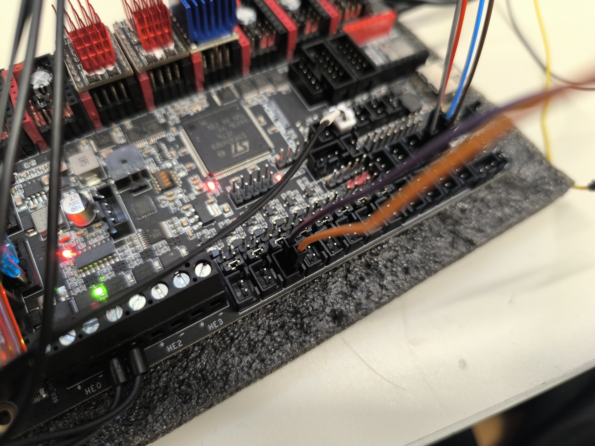

# BTT Octopus Pro V1.1 — Guia de configuració

> Placa base del projecte. Controla tots els motors, sensors, calefactors i ventiladors.

---

## Vista general


*Vista superior de l'Octopus Pro V1.1 sense cables: es veuen tots els slots de driver, els connectors d'alimentació (MOTOR-POWER, POWER, BED-POWER) i els terminals de motor.*


*Octopus Pro V1.1 amb els 8 slots de driver ocupats: TMC5160 (vermells) per a Z, TMC2209 (blaus) per a X, Y i extrusor.*


*Primer pla del microcontrolador STM32H723 i els connectors JST de motor. Es pot llegir clarament el xip "STM32H723ZET6" de ST Microelectronics.*

---

## Especificacions

| Camp | Valor |
|------|-------|
| **MCU** | STM32H723ZET6 (ARM Cortex-M7 @ 550MHz) |
| **Slots de driver** | 8 (MOTOR 0 → MOTOR 7) |
| **Calefactors hotend** | 4 (HE0–HE3) |
| **Llit** | 1 sortida dedicada (BED-OUT) |
| **Ventiladors** | 6 PWM + 2 sempre encesos |
| **Termistors** | 4 (T0–T3) + 2 PT100/PT1000 |
| **Endstops** | 6 + suporta sensors virtuals |
| **Firmware** | Klipper, Marlin, RRF |
| **Connexió CB1** | USB-C (muntatge directe o cable) |

---

## Slots de driver — Assignació al nostre projecte


*Vista dels 8 slots amb drivers instal·lats i cables de motor connectats. Els vermells són TMC5160 (Z), els blaus són TMC2209.*

| Slot | Component | Driver | Estat |
|------|-----------|--------|-------|
| MOTOR 0 | Eix X | TMC2209 blau | ✅ Actiu |
| MOTOR 1 | Eix Z esquerra | TMC5160 vermell | ✅ Actiu |
| MOTOR 2_1 | Eix Y (dual paral·lel) | TMC2209 blau | ✅ Actiu |
| MOTOR 2_2 | Motor Y dret (paral·lel físic) | — | ✅ Actiu |
| MOTOR 3 | — | — | ❌ **DEFECTUÓS** |
| MOTOR 4 | Extrusor SO3 | TMC2209 blau | ✅ Actiu |
| MOTOR 5 | Eix Z dret | TMC5160 vermell | ✅ Actiu |
| MOTOR 6-7 | Lliures | — | — |

---

## Protocol de drivers: UART vs SPI

La placa suporta tots dos protocols simultàniament:

### UART (TMC2209)
- 1 sol cable de dades per driver
- Configuració més senzilla
- Màx. ~1.5A continu

```ini
# Exemple UART (eix X)
[tmc2209 stepper_x]
uart_pin: PC4    # Pin UART únic per driver
```

### SPI (TMC5160)
- 4 cables compartits (MISO/MOSI/SCK) + 1 Chip Select per driver
- Major corrent possible (fins a 3A RMS)
- Telemetria més detallada

```ini
# Exemple SPI (eix Z)
[tmc5160 stepper_z]
cs_pin: PD11                    # Chip Select únic
spi_software_miso_pin: PA6      # Compartit entre tots els TMC5160
spi_software_mosi_pin: PA7
spi_software_sclk_pin: PA5
```

---

## Jumpers de tensió — Configuració crítica

L'Octopus Pro té jumpers per configurar la tensió de cada slot de driver. Per als TMC5160 és **obligatori** posar-los correctament:

- **TMC5160:** Jumper en posició `VFused` (tensió de motor, no 5V)
- **TMC2209:** Jumper en posició `VFused` també

> Error freqüent: Jumper mal posat en un slot amb TMC5160 → el driver no rep tensió suficient → el motor no es mou o es mou erràticament.

---

## Alimentació

La placa té **tres entrades d'alimentació independents**:

```
┌─────────────────────────────────────────────────────┐
│  MOTOR-POWER ────── 24V/12-60V per a tots els drives│
│  POWER       ────── 24V per a lògica i calefactors  │
│  BED-POWER   ────── 24V per al llit calefactat      │
└─────────────────────────────────────────────────────┘
```

Mantenir BED-POWER separat és important: el llit consumeix molt de corrent i pot introduir soroll als senyals de pas si comparteix el rail amb els motors.

### La nostra configuració actual

En aquest projecte hem **pontat les tres entrades** d'alimentació entre si per simplificar el cablejat i poder usar una única font d'alimentació 24V.

> **Millora futura:** Separarem l'entrada `BED-POWER` per connectar un **relé d'alta potència** que gestionarà els 4 llits calefactats de 500×500mm. El relé permet controlar grans corrents (>20A) que el MOSFET integrat de la placa no pot gestionar directament.

---

## Connectors de temperatura (T0–T3)

Els connectors T de la placa serveixen principalment per a termistors, però són entrades digitals de 2 pins. Al nostre projecte:

| Connector | Ús normal | El nostre ús |
|-----------|-----------|--------------|
| T0 (PF4) | Termistor hotend | Termistor ATC Semitec SO3 |
| T1 (PF5) | Endstop X (reconvertit) | Final de carrera eix X |
| T2 (PF6) | Endstop Y (reconvertit) | Final de carrera eix Y |
| T3 (PF7) | Lliure | Endstop Z màxim de seguretat |
| BED (PF3) | Termistor llit | Termistor llit (pendent) |

---

## Arquitectura del sistema — Dues plaques

El sistema utilitza **dues plaques diferenciades**:

| Placa | Funció |
|-------|--------|
| **BTT Octopus Pro** (MCU STM32H723) | Controla motors pas a pas, temperatura, llit calefactat i ventiladors en temps real |
| **BTT CB1** (ARM Cortex-A55, Linux) | L'"ordinador": WiFi, interfície web Fluidd, pantalla KlipperScreen, accés remot des de qualsevol dispositiu |

El CB1 executa Klipper en Linux i envia comandes al STM32 de l'Octopus Pro per USB. L'usuari controla tot des de Fluidd (navegador web) o des de la pantalla tàctil KlipperScreen.

## Connexió amb CB1

El BTT CB1 es munta directament sobre l'Octopus Pro (interfície M.2 o similar). La comunicació es fa per USB-C. Klipper al CB1 parla amb el firmware al STM32 de l'Octopus Pro per aquest canal.

Per identificar el port sèrie correcte:
```bash
ls /dev/serial/by-id/
# Resultat: usb-Klipper_stm32h723xx_15000F001051313531383332-if00
```

Aquest ID s'usa a `printer.cfg`:
```ini
[mcu]
serial: /dev/serial/by-id/usb-Klipper_stm32h723xx_15000F001051313531383332-if00
```

---

## Recursos oficials

- [Repositori GitHub BTT Octopus Pro](https://github.com/bigtreetech/BIGTREETECH-OCTOPUS-Pro)
- [Manual PDF oficial BTT](https://github.com/bigtreetech/BIGTREETECH-OCTOPUS-Pro/blob/master/BIGTREETECH%20Octopus%20Pro%20V1.0%20user%20manual.pdf)
- [Referència 3DPrinters-Guide](https://3dprinters-guide.com/bigtreetech-octopus-pro-v1-1-h723-review-a-deep-dive-into-high-speed-3d-printing/)
