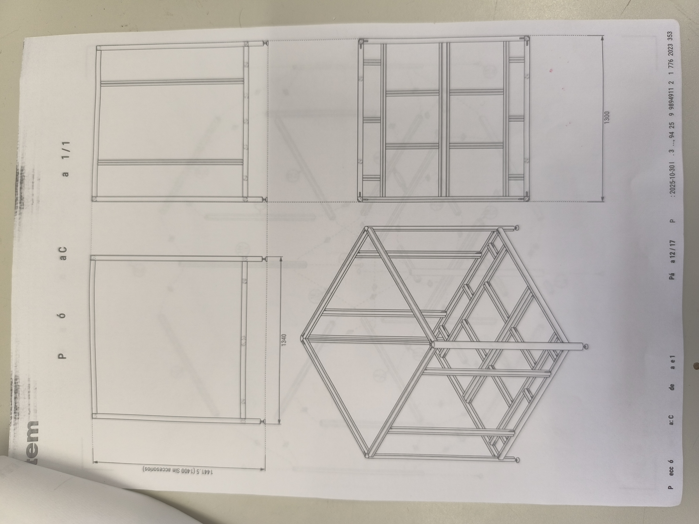
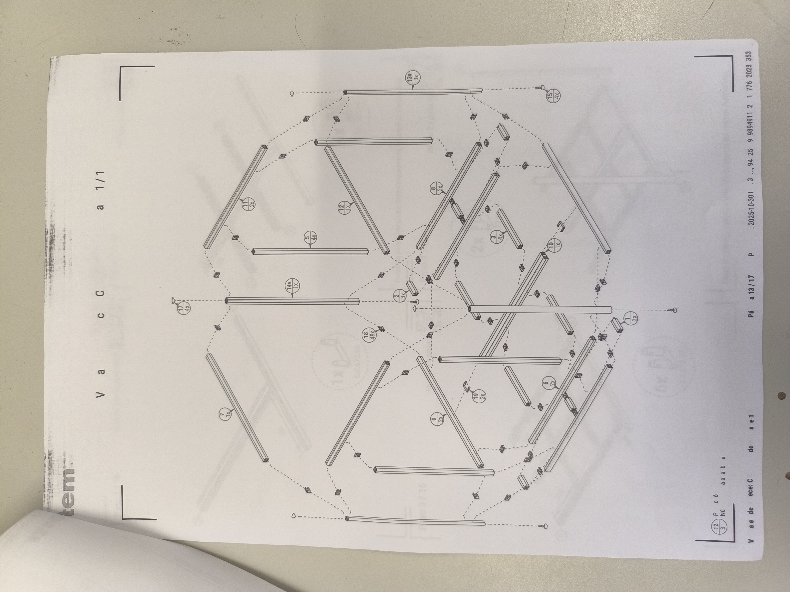
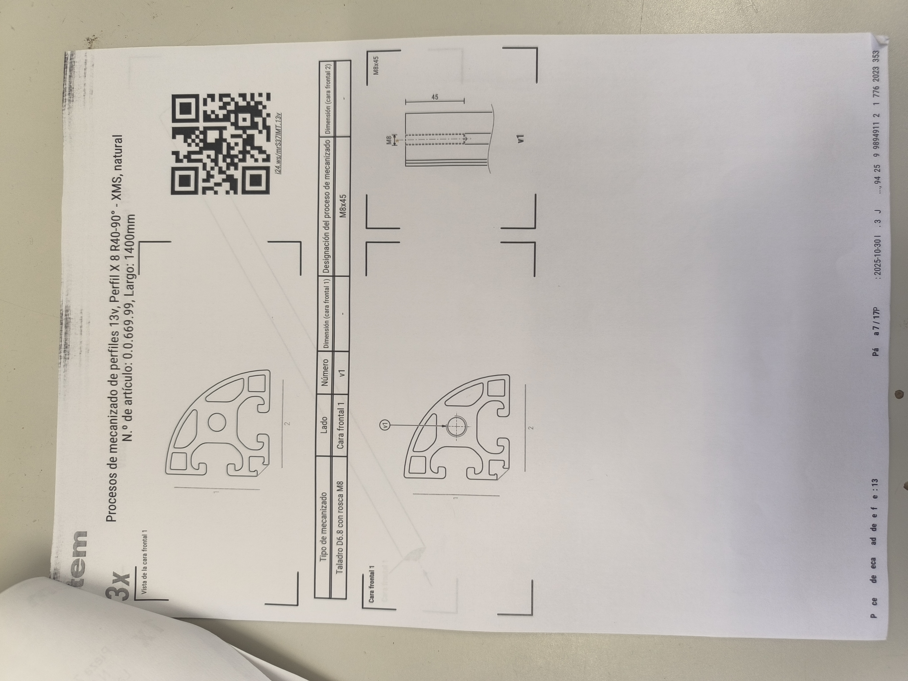
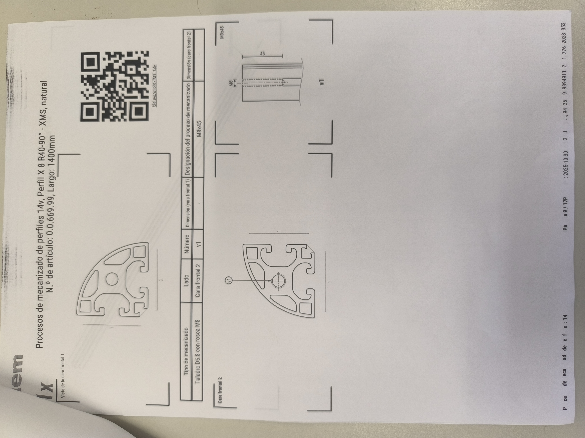
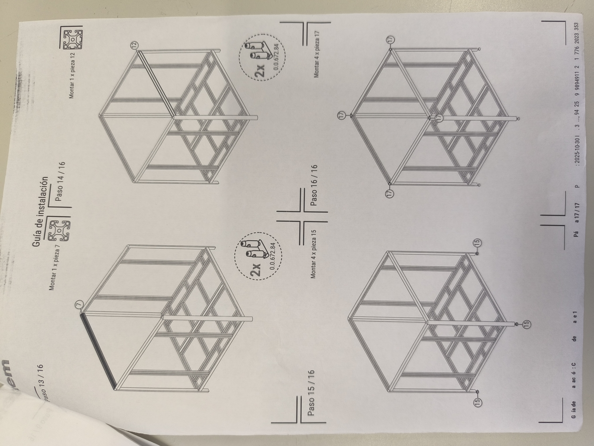

# Plànols estructurals — Marc d'alumini item

> Els perfils d'alumini del marc són de la marca **item** (Industrietechnik GmbH), fabricant alemany especialitzat en perfils d'alumini tècnic per a maquinària industrial.

---

## Especificacions del perfil

| Paràmetre | Valor |
|-----------|-------|
| **Marca** | item Industrietechnik |
| **Sèrie** | Perfil X 8 (ranura 8 mm) |
| **Tipus** | R40-90° — XMS, natural |
| **N.° d'article** | 0.0.669.99 |
| **Secció** | 40 × 80 mm |
| **Longitud de tall** | 1400 mm (dimensió exterior del marc 1441.5 mm amb accessoris) |
| **Mecanitzat** | Forat D6.8 amb rosca M8 a la cara frontal |
| **Material** | Alumini 6060-T66, anoditzat natural |

---

## Plànols del projecte (17 pàgines)

Els plànols complets del projecte es van elaborar amb el programari d'item i comprenen **17 pàgines** amb especificacions de perfils, llista de materials, guia d'instal·lació pas a pas i vistes tècniques.

### Vistes generals del marc

*Pàgina 11/17: Vista isomètrica del marc complet. Dimensió exterior: 1441.5 mm (1400 mm sense accessoris).*

*Pàgina 12/17: Vistes frontal, lateral i alçat amb cotes principals (1300 mm d'alçada, 1340 mm d'amplada).*

### Llista de materials i explosionat

*Pàgina 13/17: Vista explosionada mostrant tots els perfils individuals i les seves unions. Cada perfil té un número de posició que referencia la BOM.*

### Especificacions de perfils

*Pàgina 7/17: Especificació del perfil tipus "13v" — 3 unitats, 1400 mm. Forat M8 a la cara frontal 1.*

*Pàgina 9/17: Especificació del perfil tipus "14v" — 1 unitat, 1400 mm. Forat M8 a la cara frontal 2.*

### Guia d'instal·lació

*Pàgina 17/17: Passos 13-16 de la guia d'instal·lació. Ítem 0.0.672.84 = connector angular de cantonada (2 unitats per pas).*

---

## Connectors i cargoleria item

| Component | N.° article item | Descripció |
|-----------|-----------------|------------|
| Connector angular | 0.0.672.84 | Angle de 90° per unir perfils a les cantonades |
| Femella T ranura 8 | — | M4/M5/M8 segons aplicació |
| Cargol de cap cilíndric | — | M8 × 45 mm per a connectors de cantonada |

---

